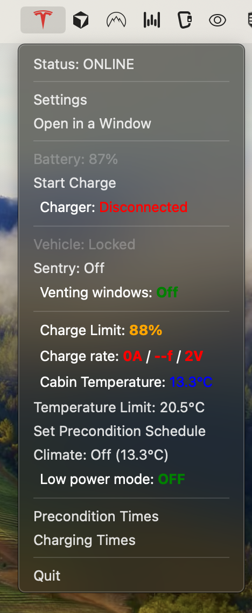
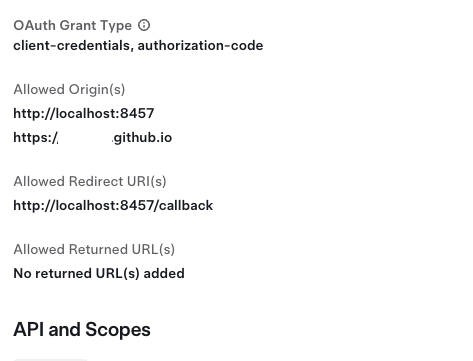
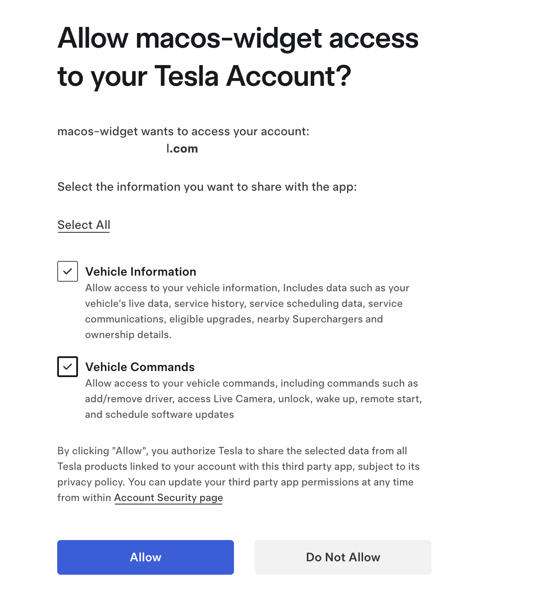
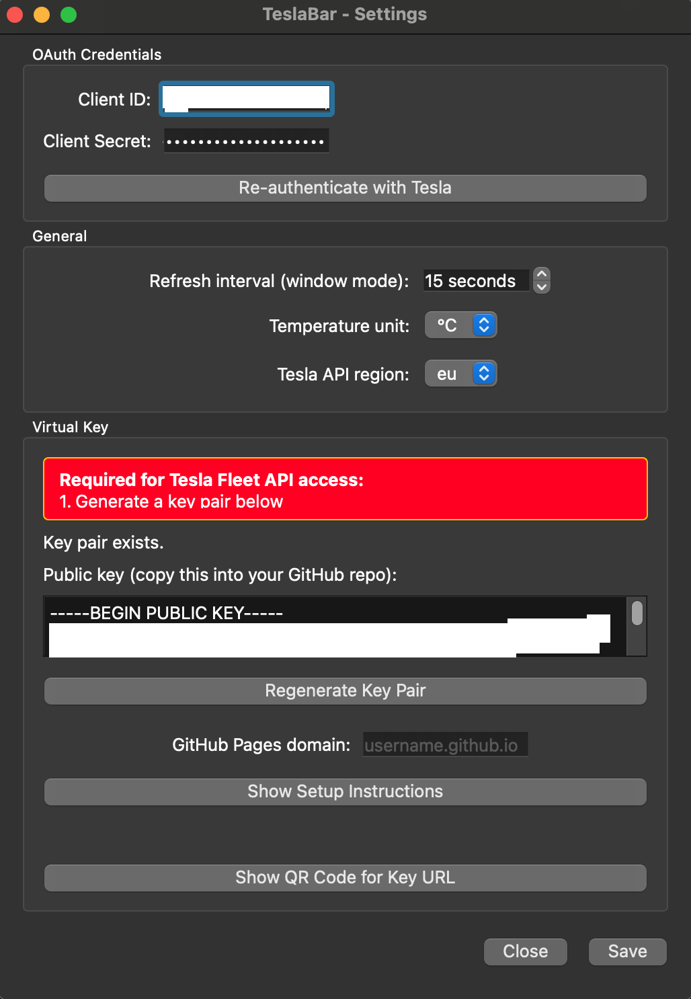
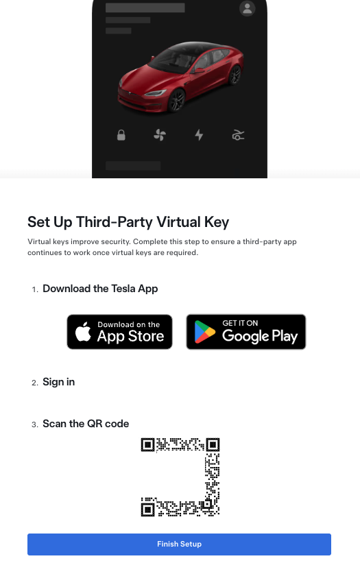
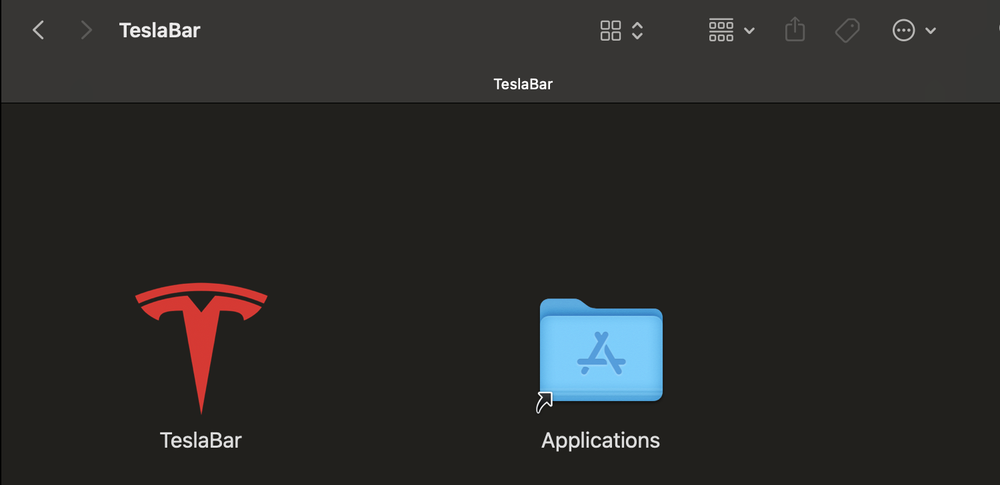
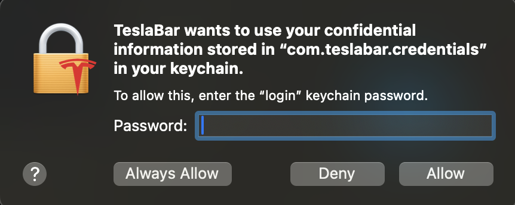
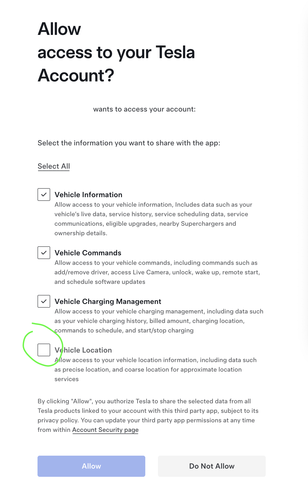

# tesla-macos-status-menu-bar-widget

A macOS (and Windows) menu bar app for controlling your Tesla vehicle via the Tesla Fleet API. Built with Python 3.14 and PySide6.

# Tesla Widget




## Project Structure

```
widget/
├── run.sh                          # Quick launcher
├── Info.plist                      # macOS: LSUIElement + URL scheme
├── pyproject.toml                  # Python project config
├── requirements.txt
├── resources/
│   └── tesla_icon.png              # Tesla logo for menu bar
└── teslabar/
    ├── __init__.py
    ├── __main__.py                 # Entry point + asyncio-Qt bridge
    ├── config.py                   # Settings persistence (JSON)
    ├── crypto/
    │   ├── credential_store.py     # AES-GCM encryption + Keychain
    │   └── virtual_key.py          # EC key pair gen + GitHub Pages guide
    ├── services/
    │   ├── oauth_server.py         # Local HTTP callback for OAuth
    │   └── tesla_api.py            # Tesla Fleet API wrapper
    └── ui/
        ├── charge_limit_popup.py   # Slider popup (50-100%)
        ├── main_window.py          # "Open in Window" mode + auto-refresh
        ├── password_dialog.py      # First-run + returning user flows
        ├── schedule_window.py      # Precondition & Charging schedule mgmt
        ├── settings_window.py      # Settings + Virtual Key + QR code
        ├── status_window.py        # Logs/errors/vehicle state
        └── tray_app.py             # System tray icon + main menu
```

## Key Features

- **Password-encrypted credentials** — AES-256-GCM via PBKDF2, stored in macOS Keychain (falls back to file on Windows)
- **3 attempt lockout** — 5s delay per attempt, 60s lockout after 3 failures
- **OAuth 2.0 flow** — Local HTTP server on port 8457 for callback, auto-opens browser
- **Token refresh** — Checks expiry before each API call, auto-refreshes; shows RE-AUTHENTICATE when refresh token is dead
- **Menu bar only** — LSUIElement hides from Dock; NSBundle runtime override for development
- **Refresh on menu open only** — No API calls when menu is closed
- **Window mode** — Auto-refreshes at configurable interval (default 15s)
- **Virtual key** — EC P-256 key pair, QR code for tesla.com/_ak/<domain>, GitHub Pages instructions
- **All specified menu items** — Status, Settings, Window mode, Battery, Charge toggle, Charger status, Lock status (read-only), Sentry (read-only), Charge limit slider, Precondition schedule, Climate toggle, Schedule lists, Quit
- **Region selector** — EU/NA/CN
- **Tesla Fleet API** — Uses python-tesla-fleet-api library with proper per-VIN VehicleFleet objects

## Running

```bash
./run.sh
# or
source .venv/bin/activate && python -m teslabar
```

## Setup

```bash
python3 -m venv .venv
source .venv/bin/activate
pip install PySide6 tesla-fleet-api cryptography keyring "qrcode[pil]" aiohttp
```

On first launch, you'll be prompted to set a password and enter your Tesla OAuth Client ID and Client Secret from [developer.tesla.com](https://developer.tesla.com).

## Tesla Fleet API Setup

Follow these steps to register your app with the Tesla Fleet API and connect it to your vehicle.

### Step 1 — Create a Tesla Developer App

1. Go to [developer.tesla.com](https://developer.tesla.com) and sign in with your Tesla account.
2. Create a new application.
3. Configure the **OAuth Grant Type** to include both `client-credentials` and `authorization-code`.
4. Set the following URLs:

| Field | Value |
|---|---|
| **Allowed Origin(s)** | `http://localhost:8457` and `https://<username>.github.io` |
| **Allowed Redirect URI(s)** | `http://localhost:8457/callback` |
| **Allowed Returned URL(s)** | *(leave empty)* |



5. Note down your **Client ID** and **Client Secret** — you'll need them on first launch.

### Step 2 — Authorize the app with your Tesla account

When TeslaBar starts the OAuth flow, your browser will open the Tesla consent screen. Make sure to check both:

- **Vehicle Information** — live data, service history, scheduling, nearby Superchargers
- **Vehicle Commands** — add/remove driver, unlock, wake up, remote start, schedule updates

Click **Allow** to grant access.



### Step 3 — Set up the Virtual Key

Tesla Fleet API requires a third-party virtual key to be installed on your vehicle before you can send commands.

1. Open **TeslaBar → Settings** and generate a key pair in the **Virtual Key** section.
2. Host the public key on GitHub Pages (see section below).
3. Enter your GitHub Pages domain (e.g. `username.github.io`) in Settings and click **Save**.



### Step 4 — Install the Virtual Key on your vehicle

1. Open `https://tesla.com/_ak/<your-domain>` on your phone (or scan the QR code from Settings).
2. The Tesla app will prompt you to **Set Up Third-Party Virtual Key**.
3. Tap **Finish Setup** while near your vehicle — the car's screen will ask you to confirm.



After the key is installed, TeslaBar can send commands (start/stop charge, climate, etc.) to your vehicle.

## Install on MacOS 
Download the newest release (instead of compiling from source). 
The *.dmg is NOT signed so you can install going though a couple of security popups or you could try the following: 

#### Disable Gatekeeper System-Wide
`sudo spctl --master-disable`

#### Skip DMG Verification 
```bash
defaults write com.apple.frameworks.diskimages skip-verify -bool true
defaults write com.apple.frameworks.diskimages skip-verify-locked -bool true
defaults write com.apple.frameworks.diskimages skip-verify-remote -bool true
```
### To recursively remove Quarantine from an entire app bundle or directory:
`xattr -r -d com.apple.quarantine /path/to/app.app`

### popups - access keychain





## When doing OAuth - remember to give Tesla permission to get the car's location if you wish to use locaation in the app (optional)




<h2>Host your public key on GitHub Pages (click to expand)</h2>
<details>
### Step 1 — Create a GitHub repository

Tesla requires the public key to be served at the **root of your GitHub Pages domain**, e.g. `https://<username>.github.io/.well-known/appspecific/com.tesla.3p.public-key.pem`. This means you must use your **user site repository** (`<username>.github.io`), not a project repository with a subpath.

Create a public GitHub repository named `<your-username>.github.io` and clone it locally.

```bash
git clone https://github.com/<your-username>/<your-username>.github.io.git
cd <your-username>.github.io
```

### Step 2 — Create the required directory structure

Tesla expects the public key file to exist at the exact `/.well-known/appspecific/com.tesla.3p.public-key.pem` path. Because GitHub Pages uses Jekyll by default, you must also add `_config.yml` with `include: [".well-known"]` or the folder may not be published.

```bash
mkdir -p .well-known/appspecific/
cp ~/TeslaKeys/tesla-public-key.pem .well-known/appspecific/com.tesla.3p.public-key.pem
echo 'include: [".well-known"]' > _config.yml
```

Your repository should look like this:

```text
<username>.github.io/
├── _config.yml
├── README.md
└── .well-known/
    └── appspecific/
        └── com.tesla.3p.public-key.pem
```

### Step 3 — Commit and push

```bash
git add .
git commit -m "Add Tesla Fleet API public key"
git push origin main
```

### Step 4 — Enable GitHub Pages

In your repository, open **Settings → Pages**, choose **Deploy from a branch**, select `main` and `/ (root)`, then save. GitHub Pages will publish your site at `https://<username>.github.io/`.

**Important:** Tesla requires the key at the root of the domain (`https://<username>.github.io/.well-known/...`), so you must use the user site repository (`<username>.github.io`), not a project repository with a subpath.

### Step 5 — Verify the file is reachable

Check that the file is publicly accessible and returns HTTP 200.

```bash
curl -I "https://<username>.github.io/.well-known/appspecific/com.tesla.3p.public-key.pem"
```

You should be able to open the URL in a browser and see a PEM public key beginning with `-----BEGIN PUBLIC KEY-----`. Tesla integrations commonly fail when this file is missing or the URL path does not exactly match what Tesla expects.

</details>
